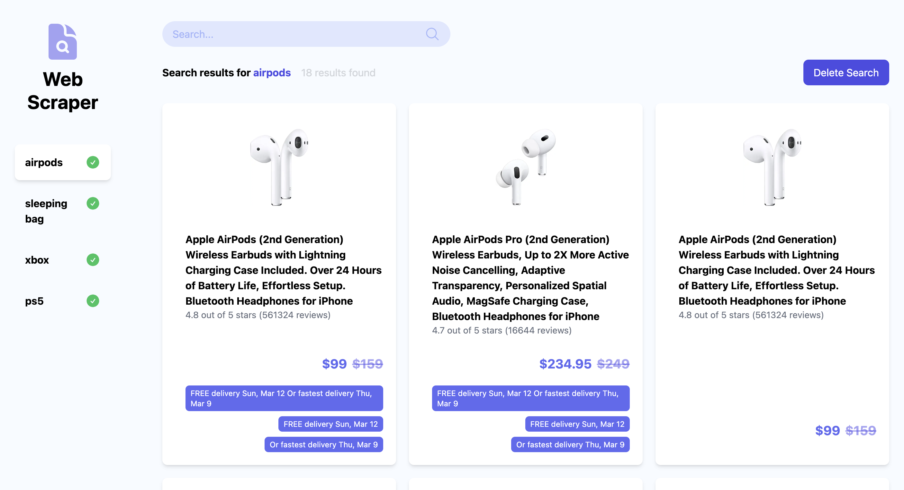

# Amazon Web Scraper

Project that scrapes information from Amazon website using, Brightdata and Webhooks. Powered by Next.js and deployed on Vercel.

## Demo

You can access the web demo at https://brightdata-amazon-scraper-lovat.vercel.app/

## Screenshots



## Tools

**Bright Data**

https://brightdata.com/

**Fire Base**

- Used as backend for data storage
  https://console.firebase.google.com/u/0/

- Cloud functions to create a webhoook
  https://github.com/KotaUeshima/amazon-scraper-backend
- switch to Node 18 using NVM (Node Version Manager)

Run local server for cloud function

```
npm run serve
```

**Ngrok**

- Tunneling allows you to temporarily create a public server from a locally hosted server

## Libraries

**Firebase**

```
npm install firebase-admin
npm install firebase
npm install react-firebase-hooks
```

**UI Tools**

```
npm install @heroicons/react
npm install react-spinkit
npm install @types/react-spinkit
npm install react-hot-toast
```

## Credit

- Project based on content created by Sonny Sangha, much appreciate to his youtube channel
- https://www.youtube.com/@SonnySangha
